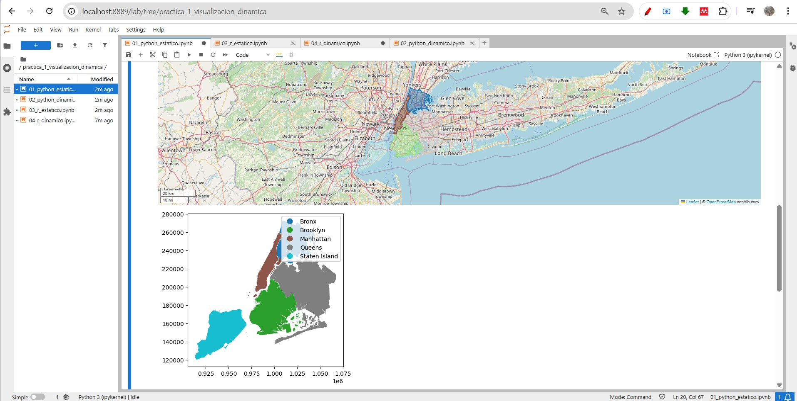
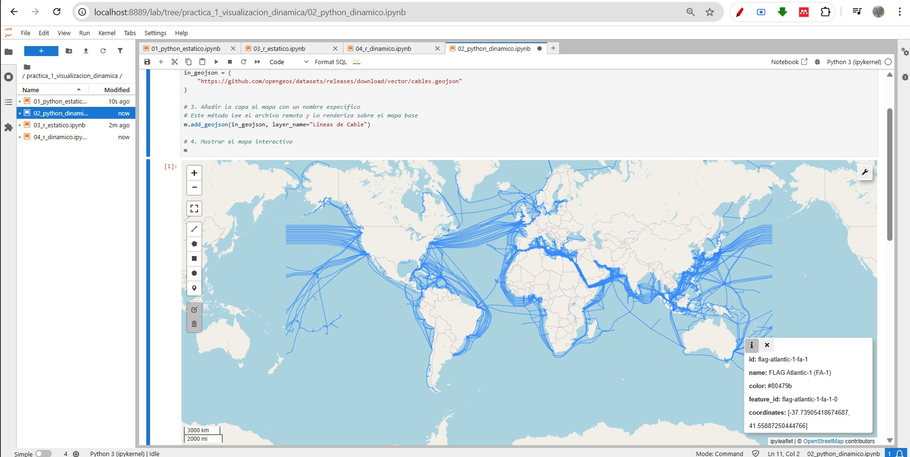
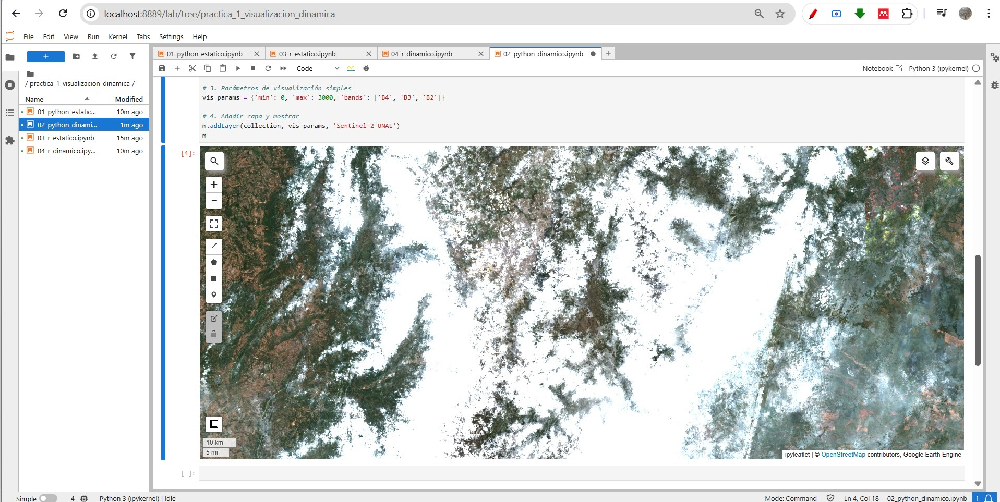
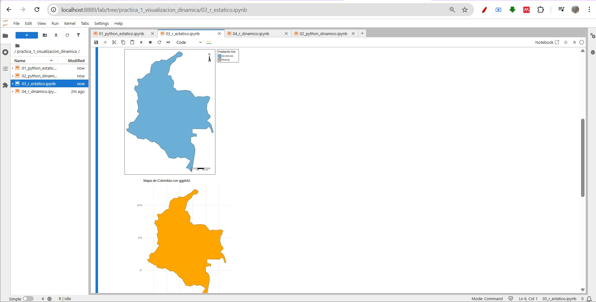
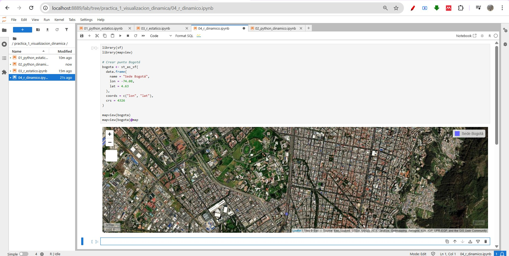
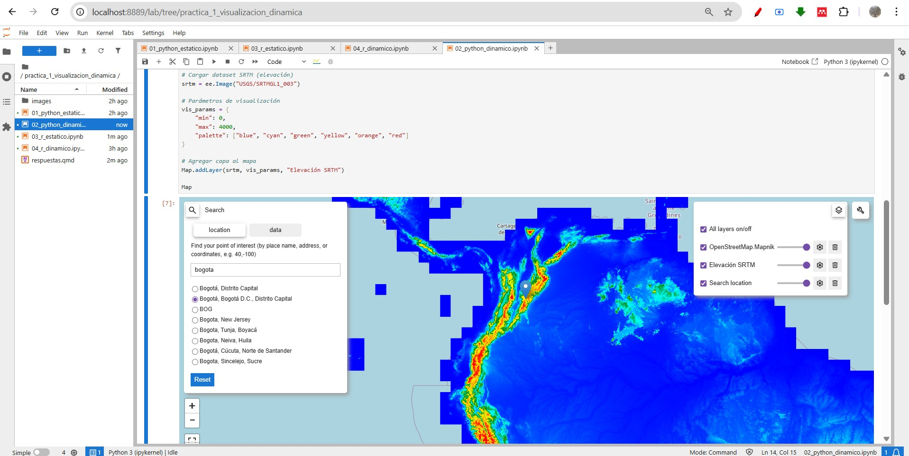

# Contexto General

La geomática integra programación, cartografía digital y análisis espacial para la gestión avanzada de información territorial.  

Este taller tuvo como propósito validar el correcto funcionamiento del entorno Docker/Jupyter, así como explorar herramientas de visualización estática y dinámica en Python y R.

::: {.callout-tip}
Todos los cuadernos fueron ejecutados en **Jupyter Lab** dentro del contenedor Docker configurado para el curso.
:::

---

# Parte A — Reproducibilidad de Notebooks

El objetivo fue ejecutar exactamente el código desarrollado en clase para validar:

- Configuración del kernel Python
- Configuración del kernel R
- Integración de librerías geoespaciales
- Correcta renderización de mapas estáticos y dinámicos

---

## 01_python_estatico.ipynb

Se utilizó `geopandas` junto con `geodatasets` para visualizar el dataset **nybb (New York Borough Boundaries)**.

El método `.plot()` permitió generar un mapa estático usando Matplotlib.

### Resultado

{#fig-python-estatico}

---

## 02_python_dinamico.ipynb

Se trabajó con dos librerías del ecosistema OpenGeos:

- `leafmap`
- `geemap`

### Leafmap — Cables Submarinos

Se cargó un archivo GeoJSON remoto y se visualizó sobre un mapa base interactivo.

{#fig-python-dinamico-cables}

---

### Geemap — Sentinel-2 Armonizada

Se utilizó la colección: COPERNICUS/S2_SR_HARMONIZED


Filtrando primer trimestre 2024 y visualizando bandas RGB.

{#fig-python-dinamico-sentinel}

---

## 03_r_estatico.ipynb

Se empleó:

- `sf`
- `tmap`
- `ggplot2`

Para generar un mapa temático de Colombia con:

- Simbología por población estimada
- Brújula
- Escala gráfica

{#fig-r-estatico}

---

## 04_r_dinamico.ipynb

Se utilizó `mapview` para crear un visor interactivo mostrando un punto correspondiente a la Sede Bogotá.

Se configuró correctamente para entorno notebook.

{#fig-r-dinamico}

---

# Parte B — Desafío de Exploración

Para el desafío de exploración se seleccionó la librería **Geemap**, implementando una funcionalidad diferente a la vista en clase mediante la carga de un Modelo Digital de Elevación (SRTM).

A diferencia del ejercicio previo con Sentinel-2 (imágenes multiespectrales), en esta sección se trabajó con un raster continuo de elevación.

---

## Implementación — Elevación SRTM

```python
import geemap
import ee

# Inicializar Earth Engine
ee.Initialize()

# Crear mapa centrado en Colombia
Map = geemap.Map(center=[4.5, -74], zoom=6)

# Cargar modelo digital de elevación SRTM
srtm = ee.Image("USGS/SRTMGL1_003")

# Parámetros de visualización
vis_params = {
    "min": 0,
    "max": 4000,
    "palette": ["blue", "cyan", "green", "yellow", "orange", "red"]
}

# Agregar capa al mapa
Map.addLayer(srtm, vis_params, "Elevación SRTM")

Map
```

{#fig-geemap-srtm}

Como se observa en la Figura @fig-geemap-srtm, el gradiente altitudinal permite identificar claramente las zonas montañosas de la cordillera de los Andes en Colombia.

## Análisis Técnico

El dataset USGS/SRTMGL1_003 corresponde al modelo digital de elevación global con resolución aproximada de 30 metros.

La aplicación de una paleta de colores permite representar gradientes altitudinales de manera intuitiva, facilitando:

Identificación de zonas montañosas

Análisis preliminar de pendientes

Evaluación de posibles zonas de riesgo por deslizamiento

::: {.callout-tip}
Esta funcionalidad es particularmente relevante en estudios geomorfológicos e hidrológicos.
:::


# Preguntas de Análisis
## 🥇 Facilidad e Intuición

La librería más intuitiva para un usuario sin experiencia en programación es Leafmap.

Su sintaxis simple, la disponibilidad de mapas base automáticos y la facilidad para cargar datos remotos reducen significativamente la barrera de entrada.

Desde una perspectiva pedagógica, resulta adecuada para introducir visualización geoespacial interactiva.

## 🎨 Calidad Cartográfica

Para la entrega de un informe técnico en PDF, tmap ofrece el mejor acabado visual.

Permite:

Control detallado de simbología

Inclusión de elementos cartográficos formales

Configuración orientada a impresión

Si bien matplotlib y ggplot2 son potentes, requieren mayor personalización manual para alcanzar estándares cartográficos profesionales.

## 🌐 Potencial de la Documentación

La integración con Google Earth Engine a través de geemap representa una de las funcionalidades más potentes del ecosistema OpenGeos.

Permite:

Acceso a grandes volúmenes de datos satelitales

Procesamiento en la nube

Análisis multitemporal

Para investigación aplicada, esta capacidad facilita estudios de cambio de cobertura, monitoreo ambiental y análisis de índices espectrales.

## 🧠 Elección de Herramientas

En una situación de emergencia ambiental donde se requiere desplegar un visor web en menos de cinco minutos, elegiría Leafmap.

Permite crear un mapa interactivo rápidamente, cargar un GeoJSON de inundación y exportar un archivo HTML compartible sin necesidad de infraestructura adicional.

Su simplicidad operativa lo convierte en una herramienta eficiente para escenarios de respuesta inmediata.

# Conclusiones

La reproducibilidad es fundamental en proyectos geoespaciales.

Python facilita la integración web y la automatización.

R presenta ventajas en cartografía temática de alta calidad.

El ecosistema OpenGeos amplía significativamente las capacidades de análisis y visualización.

La combinación Quarto + Notebooks permite generar documentación reproducible en múltiples formatos.

::: {.callout-tip}
Si un mapa dinámico no carga correctamente, es fundamental revisar:

Kernel activo

Autenticación en Earth Engine

Consola de VSCode/Jupyter

Dependencias de JavaScript
:::