# Contexto del Taller

La interoperabilidad entre plataformas SIG es un aspecto fundamental en los flujos de trabajo geomáticos actuales.  
En proyectos reales es común trabajar con diferentes formatos de datos, sistemas de referencia espacial y motores de bases de datos geográficas.

En esta evaluación se desarrollaron dos ejercicios enfocados en:

- Conversión de formatos para visualización web.
- Procesos ETL espaciales para carga de datos en bases de datos geográficas.

::: {.callout-tip}
El manejo adecuado de formatos y sistemas de coordenadas garantiza la correcta interoperabilidad entre plataformas SIG.
:::

---

# Ejercicio 1 – Intercambio de formatos para visualización web (KML)

El formato **KML (Keyhole Markup Language)** es un estándar utilizado para visualizar información geográfica en plataformas como Google Earth.

Este formato exige que los datos se encuentren en coordenadas geográficas **WGS84 (EPSG:4326)**, ya que el visor no realiza reproyección automática.

El objetivo del ejercicio fue exportar capas vectoriales a formato **KML/KMZ** asegurando que el sistema de coordenadas fuera compatible.

---

## Exportación desde ArcGIS Pro – Map To KML

Se utilizó la herramienta:

```
Conversion Tools → To KML → Map To KML
```

Esta herramienta exporta todas las capas visibles del mapa a un archivo KMZ.

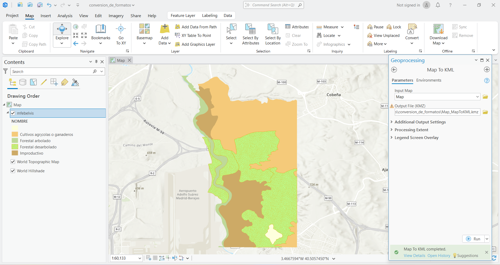{#fig-map-to-kml}

---

### Validación en Google Earth

El archivo KMZ generado se abrió en Google Earth para verificar que las entidades se ubicaran correctamente sobre la superficie terrestre.

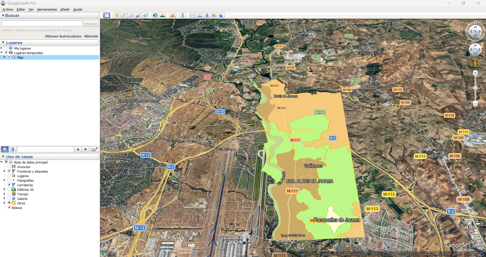{#fig-validacion-map}

---

## Exportación desde ArcGIS Pro – Layer To KML

También se utilizó la herramienta:

```
Conversion Tools → To KML → Layer To KML
```

Esta herramienta exporta únicamente una capa específica.

En la pestaña **Environments** se verificó que el sistema de salida fuera:

```
GCS_WGS_1984
```

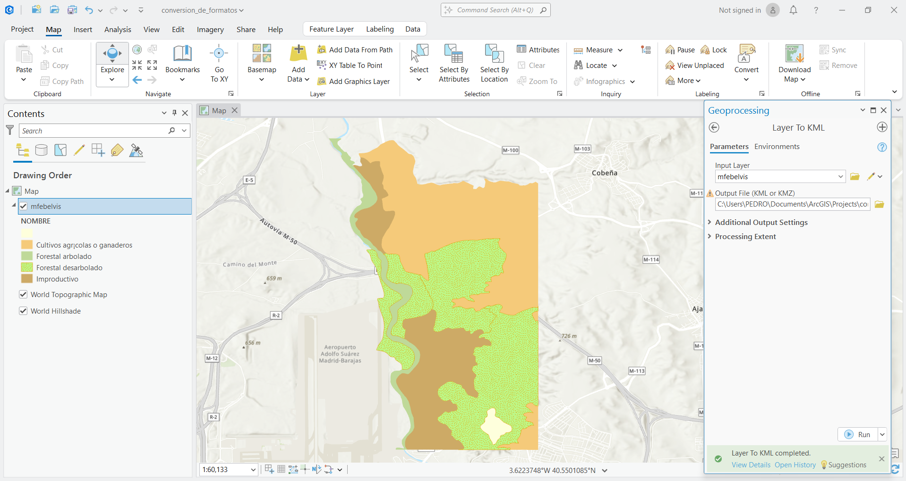{#fig-layer-kml}

---

### Validación del resultado

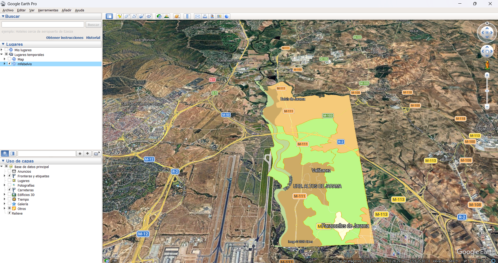{#fig-validacion-layer}

---

## Exportación desde QGIS

En QGIS se utilizó el menú contextual de la capa:

```
Click derecho → Export → Save Features As
```

Configuración aplicada:

- Formato: **KML**
- CRS: **EPSG:4326 – WGS 84**

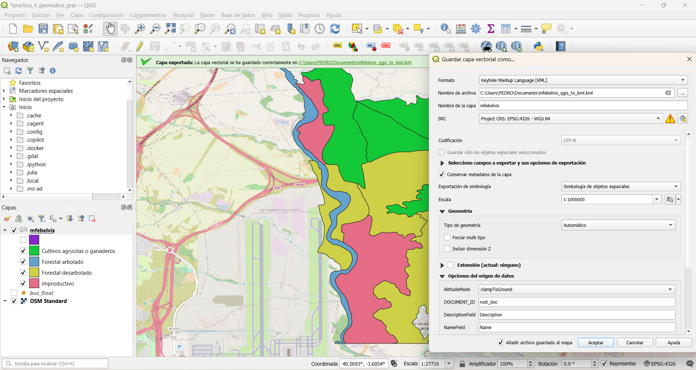{#fig-qgis-kml}

---

### Validación del archivo exportado

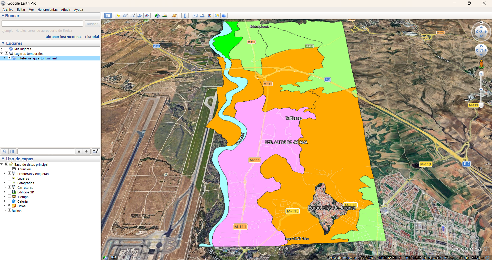{#fig-validacion-qgis}

---

## Sobre el Ejercicio 1 (Sistemas de Coordenadas) - Explicación y Respuesta

Intentar abrir un archivo KML con coordenadas planas en metros es un error común.  
Esto sucede porque el formato KML está diseñado para trabajar exclusivamente con coordenadas geográficas (latitud y longitud) en el sistema **WGS84**.

Si un archivo contiene coordenadas proyectadas, como por ejemplo UTM o sistemas planos nacionales, el visor no puede interpretarlas correctamente.

Decimos que **Google Earth no tiene proyección al vuelo** porque el software no convierte automáticamente entre distintos sistemas de coordenadas.

Como resultado, cuando un archivo con coordenadas proyectadas se abre directamente en Google Earth, las entidades aparecen desplazadas o en ubicaciones incorrectas.

::: {.callout-note}
Por esta razón es obligatorio reproyectar los datos a WGS84 antes de exportarlos al formato KML.
:::

---

# Ejercicio 2 – ETL Espacial y carga en PostGIS

Este ejercicio simuló un flujo de trabajo típico de **ETL espacial (Extract, Transform, Load)**.

El objetivo fue aplicar reglas de negocio antes de cargar los datos en una base de datos espacial basada en PostgreSQL/PostGIS.

---

## Datos de entrada

Se utilizaron los siguientes archivos:

- `MUNICIPIOS_ISLA_WGS84.shp`
- `coordenadas.kml`

El campo utilizado para aplicar el filtro de atributos fue:

```
NMG
```

que contiene el nombre del municipio.

---

## Filtro de Atributo

La primera regla consistió en eliminar municipios con **nombres compuestos**.

Se aplicó una expresión que selecciona únicamente registros cuyo nombre **no contiene espacios**.

Expresión utilizada:

```
"NMG" NOT LIKE '% %'
```

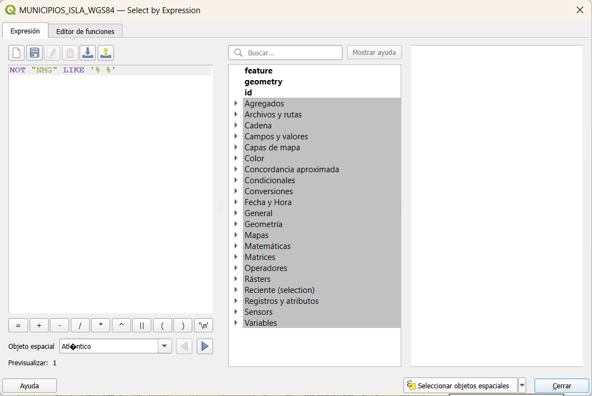{#fig-filtro-atributo}

Este filtro permite reducir el número de registros antes de realizar análisis espaciales.

---

## Creación del Buffer de 40 km

A partir de los puntos contenidos en `coordenadas.kml` se generó un buffer de 40 km.

Herramienta utilizada:

```
Vector → Geoprocesamiento → Buffer
```

Parámetro aplicado:

```
40 kilómetros
```

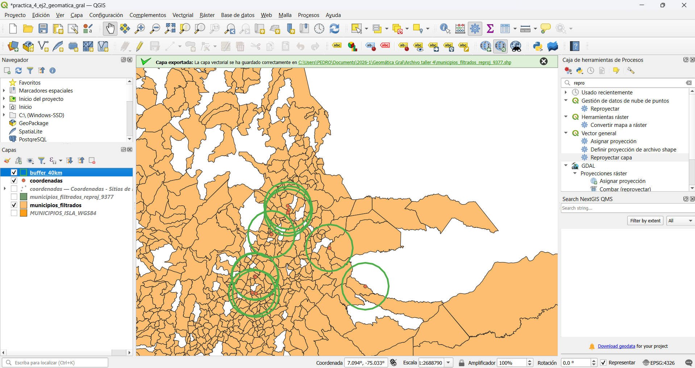{#fig-buffer}

---

## Filtro Espacial

Posteriormente se aplicó un filtro espacial para seleccionar únicamente los municipios que se encuentran dentro del buffer generado.

Herramienta utilizada:

```
Seleccionar por localización -> intersecan
```

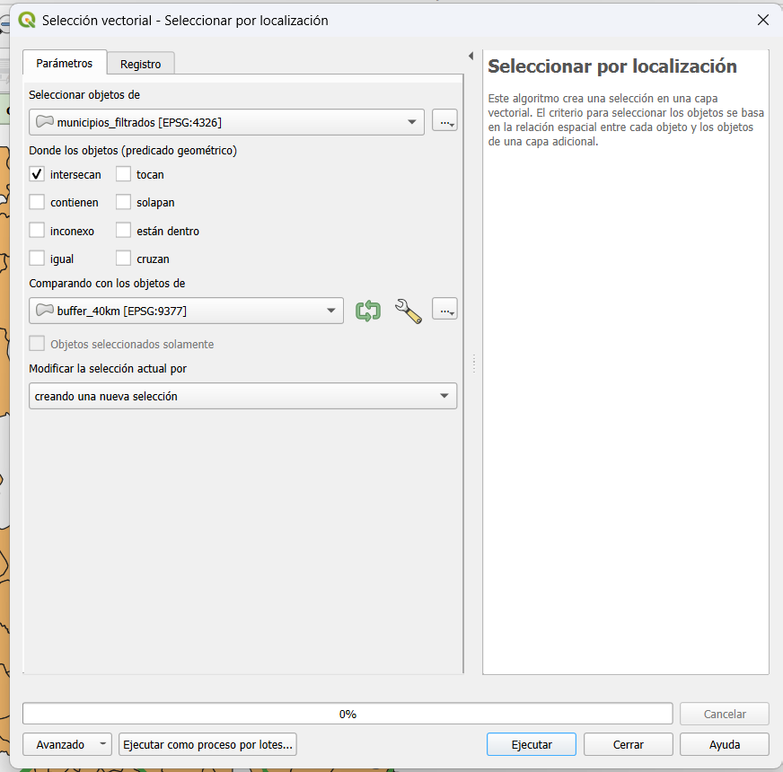{#fig-filtro-espacial}

Resultado de la selección espacial:

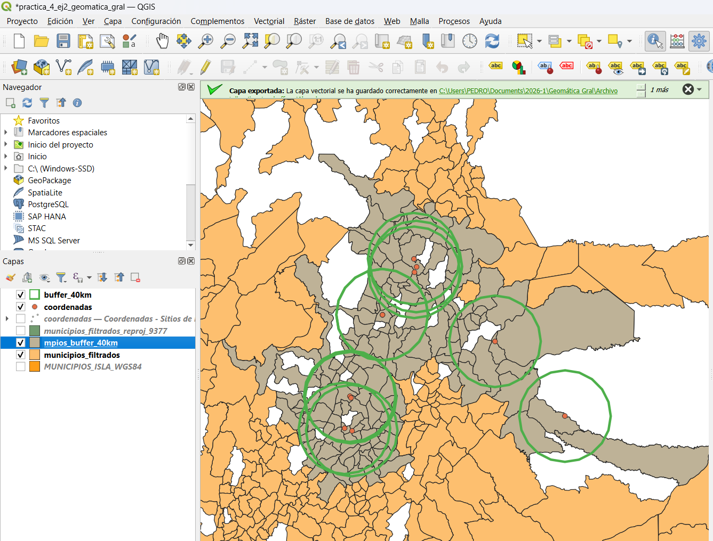{#fig-mpios-buffer}

---

## Carga final en PostGIS

Los municipios que cumplieron ambas condiciones fueron cargados en la base de datos espacial mediante el **DB Manager de QGIS**.

Configuración utilizada:

```
Schema: public
Tabla: mpios_kml
```

Tabla final cargada en PostGIS:

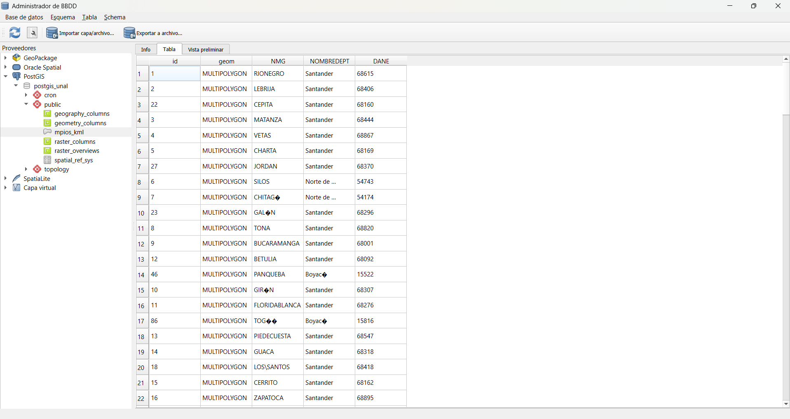{#fig-postgis-final}

---

## Sobre el Ejercicio 2 (Eficiencia ETL) - Reflexión

Para este proceso es más eficiente aplicar primero el **filtro de atributos**.

Las operaciones de comparación de texto requieren pocos recursos computacionales y permiten reducir rápidamente el número de registros.

En cambio, las operaciones espaciales como intersecciones o buffers requieren mayor capacidad de cálculo debido a la complejidad de las geometrías.

Al reducir previamente el número de entidades mediante un filtro de atributos, se disminuye la cantidad de geometrías que deben ser procesadas en el análisis espacial.

Esto genera beneficios importantes:

- menor consumo de memoria
- menor tiempo de procesamiento
- menor carga computacional

Por esta razón, aplicar primero el filtro de atributos optimiza el flujo ETL.

::: {.callout-tip}
En procesos ETL espaciales es recomendable aplicar primero filtros simples antes de ejecutar análisis espaciales complejos.
:::

---

# Reflexión sobre Interoperabilidad

Durante el proceso de carga de datos en PostgreSQL/PostGIS se observó que ArcGIS Pro presenta algunas restricciones relacionadas con la gestión de esquemas dentro de la base de datos.

En particular, ArcGIS suele requerir estructuras específicas y configuraciones adicionales para trabajar con PostgreSQL.

En contraste, QGIS ofrece una integración más flexible con bases de datos espaciales.

El uso de QGIS como herramienta intermedia facilita la carga de datos porque:

- permite importar archivos espaciales directamente a PostGIS
- detecta automáticamente geometrías y sistemas de coordenadas
- facilita la creación de índices espaciales
- permite administrar esquemas sin restricciones adicionales

Por esta razón, QGIS funciona como un **puente de interoperabilidad** entre diferentes formatos geoespaciales y motores de base de datos.

---

# Conclusiones

1. La correcta conversión de formatos geoespaciales requiere prestar atención al sistema de referencia espacial utilizado.

2. El formato KML exige que los datos estén en coordenadas geográficas WGS84 para poder visualizarse correctamente en Google Earth.

3. Los procesos ETL espaciales permiten aplicar reglas de negocio antes de cargar los datos en una base de datos geográfica.

4. Aplicar primero filtros de atributos mejora la eficiencia computacional al reducir el número de entidades involucradas en análisis espaciales.

5. Las bases de datos espaciales como PostgreSQL/PostGIS permiten almacenar y gestionar grandes volúmenes de información geográfica de forma eficiente.

::: {.callout-tip}
Antes de realizar cualquier análisis espacial siempre se debe verificar el sistema de referencia (EPSG) de los datos.
:::